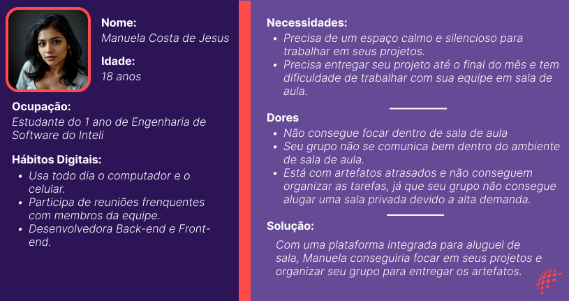
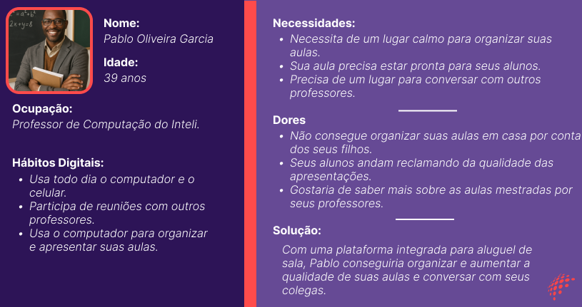

# Web Application Document - Projeto Individual - Módulo 2 - Inteli

## InteliSpace

#### João Pedro Gonçalves Corrêa Araujo

## Sumário

1. [Introdução](#c1)  
2. [Visão Geral da Aplicação Web](#c2)  
3. [Projeto Técnico da Aplicação Web](#c3)  
4. [Desenvolvimento da Aplicação Web](#c4)  
5. [Referências](#c5)  

 

## 1. Introdução (Semana 01)

O InteliSpace é um aplicativo para a reserva de salas de estudo do Instituto de Tecnologia e Liderança (Inteli). As salas no Inteli vão de R01 a R10 e a plataforma pode ser utilizada por alunos, professores, funcionários ou qualquer um que tenha um cadastro no sistema do Instituto.

O objetivo dessa plataforma é tornar a reservas de salas mais fácil e prática a todos, dessa forma, automatizando o processo de alocação e evitando problemas entre a comunidade Inteli.

Como forma de verificação, caso seja um aluno, deve informar qual ateliê e grupo pertence, dessa forma, integrantes do mesmo grupo não poderiam alocar diferentes salas. Qualquer pessoa da comunidade Inteli, só poderá reservar a mesma sala por uma hora por dia, para facilitar a rotabilidade e garantir que todos tenham acesso. Além disso, para reservar uma sala, os alunos também deve estar conectado a uma rede Inteli, para evitar que pessoas reservem salas estando fora do ambiente do Instituto. Já professores não se encaixam para essa regra.

## 2. Visão Geral da Aplicação Web

### 2.1. Personas (Semana 01)

#### Persona 1 - Manuela
Manuela Costa de Jesus é uma jovem de 18 anos que estuda no Inteli, cursando Engenharia de Software.

#### Persona 2 - Pablo Oliveira Garcia
Pablo Oliveira Garcia é um homem adulto de 39 anos que mestra aulas de computação no Inteli.

### 2.2. User Stories (Semana 01)

Identificação | US001
--- | ---
Persona | Manuela (Estudante)
User Story | Como estudante do Inteli, posso reservar uma sala, para organizar o projeto com meu grupo?
Critério de aceite 1 | CR1: Devo estar logado corretamente.
Critério de aceite 2 | CR2: Nenhum integrante do meu grupo pode ter reservado uma sala.
Critério de aceite 3 | CR3: A sala não pode estar reservada por outra pessoa. 
Critérios INVEST | Independente: Ela não necessita de outra User Story.   Negociável: Sim, ela pode escolher qual horário ou sala deseja.   Valiosa: Sim, ela precisa reservar uma sala.  Estimável: Sim, sabemos o esforço necessário pelo usuário.   Pequena: Sim, os critérios de aceite tornam-a curta.   Testável: Sim, é possível testar se o sistema de verificar que alguém reservou a sala ou se o usuário está conectado a rede funciona.

Identificação | US002
--- | ---
Persona | Manuela (Estudante)
User Story | Como estudante do Inteli, posso reservar mais de uma sala, para outra pessoa estudar?
Critério de aceite 1 | CR1: Devo estar no Inteli e conectado na rede Wi-fi.
Critério de aceite 2 | CR2: Devo estar logado corretamente.
Critério de aceite 3 | CR3: Nenhum integrante do meu grupo pode ter reservado uma sala.
Critério de aceite 4 | CR4: A sala não pode estar reservada por outra pessoa. 
Critérios INVEST | Independente: Ela não necessita de outra User Story.   Negociável: Sim, ela pode escolher qual horário ou sala deseja.   Valiosa: Sim, já que permite ao estudante reservar um espaço de estudos.  Estimável: Sim, sabemos o esforço necessário pelo usuário.   Pequena: Sim, os critérios de aceite reduzem drásticamente o tempo necessário.   Testável: Sim, é possível testar se o sistema de verifica corretamente se o usuário já reservou uma sala.

Identificação | US003
--- | ---
Persona | Manuela (Estudante)
User Story | Como estudante do Inteli, quero reservar uma sala disponível, para conseguir estudar?
Critério de aceite 2 | CR1: Devo estar no Inteli e conectado na rede Wi-fi.
Critério de aceite 2 | CR2: Devo estar logado corretamente.
Critério de aceite 3 | CR3: Nenhum integrante do meu grupo pode ter reservado uma sala.
Critério de aceite 4 | CR4: A sala não pode estar reservada por outra pessoa. 
Critérios INVEST | Independente: Sim, não depende de outra User Story.   Negociável: Sim, ela pode escolher qual horário ou sala deseja.   Valiosa: Sim, já que permite ao estudante reservar um espaço de estudos.  Estimável: Sim, sabemos o esforço necessário pelo usuário.   Pequena: Sim, os critérios de aceite reduzem drásticamente o tempo necessário.   Testável: Sim, é possível testar se o sistema de verifica corretamente se o usuário está no campus para alocar uma sala.

Identificação | US004
--- | ---
Persona | Pablo (Professor)
User Story | Como professor do Inteli, quero reservar uma sala disponível, para conseguir organizar minhas aulas?
Critério de aceite 1 | CR1: Devo estar logado corretamente.
Critério de aceite 2 | CR2: A sala não pode estar reservada por outra pessoa. 
Critérios INVEST | Independente: Não necessariamente, já que depende que o usuário esteja logado.   Negociável: Sim, ele pode escolher qual horário ou sala deseja.   Valiosa: Sim, já que permite ao professor reservar um espaço para organizar suas aulas.  Estimável: Sim, sabemos o esforço necessário pelo usuário.   Pequena: Sim, seu tempo é curto.   Testável: Sim, é possível testar se o sistema de verifica corretamente se um professor consegue reservar uma sala.

Identificação | US005
--- | ---
Persona | Pablo (Professor)
User Story | Como professor do Inteli, quero realizar login, para agendar uma sala.
Critério de aceite 1 | CR1: Devo estar cadastrado no sistema Inteli.
Critérios INVEST | Independente: Sim, não depende de outra User Story.   Negociável: Sim, caso ele não lembre sua senha, existe a opção de alterar.   Valiosa: Sim, já que permite ao professor realizar login para agendar uma sala.  Estimável: Sim, sabemos o esforço necessário pelo usuário.   Pequena: Sim, seu tempo é curto.   Testável: Sim, é possível testar se o usuário consegue realizar login no sistema.

Identificação | US006
--- | ---
Persona | Pablo (Professor)
User Story | Como professor do Inteli, quero sair da minha conta.
Critério de aceite 1 | CR1: Devo estar logado.
Critérios INVEST | Independente: Não necessariamente, já que depende que o usuário esteja logado.   Negociável: Sim, ela permite que o professor saia de sua conta.   Valiosa: Sim, já que permite ao professor sair da sua conta se necessário.  Estimável: Sim, sabemos o esforço necessário pelo usuário.   Pequena: Sim, seu tempo é curto.   Testável: Sim, é possível testar se o usuário sair de sua conta.

## 3. Projeto da Aplicação Web

### 3.1. Modelagem do banco de dados  (Semana 3)

*Posicione aqui os diagramas de modelos relacionais do seu banco de dados, apresentando todos os esquemas de tabelas e suas relações. Utilize texto para complementar suas explicações, se necessário.*

*Posicione também o modelo físico com o Schema do BD (arquivo .sql)*

### 3.1.1 BD e Models (Semana 5)
*Descreva aqui os Models implementados no sistema web*

### 3.2. Arquitetura (Semana 5)

*Posicione aqui o diagrama de arquitetura da sua solução de aplicação web. Atualize sempre que necessário.*

**Instruções para criação do diagrama de arquitetura**  
- **Model**: A camada que lida com a lógica de negócios e interage com o banco de dados.
- **View**: A camada responsável pela interface de usuário.
- **Controller**: A camada que recebe as requisições, processa as ações e atualiza o modelo e a visualização.
  
*Adicione as setas e explicações sobre como os dados fluem entre o Model, Controller e View.*

### 3.3. Wireframes (Semana 03)

*Posicione aqui as imagens do wireframe construído para sua solução e, opcionalmente, o link para acesso (mantenha o link sempre público para visualização).*

### 3.4. Guia de estilos (Semana 05)

*Descreva aqui orientações gerais para o leitor sobre como utilizar os componentes do guia de estilos de sua solução.*

### 3.5. Protótipo de alta fidelidade (Semana 05)

*Posicione aqui algumas imagens demonstrativas de seu protótipo de alta fidelidade e o link para acesso ao protótipo completo (mantenha o link sempre público para visualização).*

### 3.6. WebAPI e endpoints (Semana 05)

*Utilize um link para outra página de documentação contendo a descrição completa de cada endpoint. Ou descreva aqui cada endpoint criado para seu sistema.*  

### 3.7 Interface e Navegação (Semana 07)

*Descreva e ilustre aqui o desenvolvimento do frontend do sistema web, explicando brevemente o que foi entregue em termos de código e sistema. Utilize prints de tela para ilustrar.*

---

## 4. Desenvolvimento da Aplicação Web (Semana 8)

### 4.1 Demonstração do Sistema Web (Semana 8)

*VIDEO: Insira o link do vídeo demonstrativo nesta seção*
*Descreva e ilustre aqui o desenvolvimento do sistema web completo, explicando brevemente o que foi entregue em termos de código e sistema. Utilize prints de tela para ilustrar.*

### 4.2 Conclusões e Trabalhos Futuros (Semana 8)

*Indique pontos fortes e pontos a melhorar de maneira geral.*
*Relacione também quaisquer outras ideias que você tenha para melhorias futuras.*

## 5. Referências

_Incluir as principais referências de seu projeto, para que seu parceiro possa consultar caso ele se interessar em aprofundar. Um exemplo de referência de livro e de site:_ 

---
---