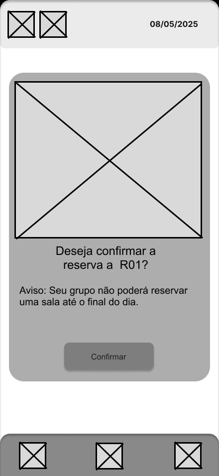

# Web Application Document - Projeto Individual - Módulo 2 - Inteli

## InteliSpace

#### João Pedro Gonçalves Corrêa Araujo

## Sumário

1. [Introdução](#c1)  
2. [Visão Geral da Aplicação Web](#c2)  
3. [Projeto Técnico da Aplicação Web](#c3)  
4. [Desenvolvimento da Aplicação Web](#c4)  
5. [Referências](#c5)  

<br>

## <a name="c1"></a>1. Introdução (Semana 01)

O InteliSpace é um aplicativo para a reserva de salas de estudo do Instituto de Tecnologia e Liderança (Inteli). As salas no Inteli vão de R01 a R10 e a plataforma pode ser utilizada por alunos, professores, funcionários ou qualquer um que tenha um cadastro no sistema do Instituto.

O objetivo dessa plataforma é tornar a reservas de salas mais fácil e prática a todos, dessa forma, automatizando o processo de alocação e evitando problemas entre a comunidade Inteli.

Como forma de verificação, caso seja um aluno, deve informar qual ateliê e grupo pertence, dessa forma, integrantes do mesmo grupo não poderiam alocar diferentes salas. Qualquer pessoa da comunidade Inteli, só poderá reservar a mesma sala por uma hora por dia, para facilitar a rotabilidade e garantir que todos tenham acesso. Além disso, para reservar uma sala, os alunos também deve estar conectado a uma rede Inteli, para evitar que pessoas reservem salas estando fora do ambiente do Instituto. 


## <a name="c2"></a>2. Visão Geral da Aplicação Web

### 2.1. Personas (Semana 01)

#### Persona 1 - Manuela
Manuela Costa de Jesus é uma jovem de 18 anos que estuda no Inteli, cursando Engenharia de Software.


#### Persona 2 - Pablo Oliveira Garcia
Pablo Oliveira Garcia é um homem adulto de 39 anos que mestra aulas de computação no Inteli.


### 2.2. User Stories (Semana 01)

Identificação | US001
--- | ---
Persona | Manuela (Estudante)
User Story | Como estudante do Inteli, posso reservar uma sala, para organizar o projeto com meu grupo?
Critério de aceite 1 | CR1: Devo estar logado corretamente.
Critério de aceite 2 | CR2: Nenhum integrante do meu grupo pode ter reservado uma sala.
Critério de aceite 3 | CR3: A sala não pode estar reservada por outra pessoa. 
Critérios INVEST | Independente: Ela não necessita de outra User Story. <br> Negociável: Sim, ela pode escolher qual horário ou sala deseja. <br> Valiosa: Sim, ela precisa reservar uma sala.<br> Estimável: Sim, sabemos o esforço necessário pelo usuário. <br> Pequena: Sim, os critérios de aceite tornam-a curta. <br> Testável: Sim, é possível testar se o sistema de verificar que alguém reservou a sala ou se o usuário está conectado a rede funciona.


Identificação | US002
--- | ---
Persona | Manuela (Estudante)
User Story | Como estudante do Inteli, posso reservar mais de uma sala, para outra pessoa estudar?
Critério de aceite 1 | CR1: Devo estar no Inteli e conectado na rede Wi-fi.
Critério de aceite 2 | CR2: Devo estar logado corretamente.
Critério de aceite 3 | CR3: Nenhum integrante do meu grupo pode ter reservado uma sala.
Critério de aceite 4 | CR4: A sala não pode estar reservada por outra pessoa. 
Critérios INVEST | Independente: Ela não necessita de outra User Story. <br> Negociável: Sim, ela pode escolher qual horário ou sala deseja. <br> Valiosa: Sim, já que permite ao estudante reservar um espaço de estudos.<br> Estimável: Sim, sabemos o esforço necessário pelo usuário. <br> Pequena: Sim, os critérios de aceite reduzem drásticamente o tempo necessário. <br> Testável: Sim, é possível testar se o sistema de verifica corretamente se o usuário já reservou uma sala.

Identificação | US003
--- | ---
Persona | Manuela (Estudante)
User Story | Como estudante do Inteli, quero reservar uma sala disponível, para conseguir estudar?
Critério de aceite 2 | CR1: Devo estar no Inteli e conectado na rede Wi-fi.
Critério de aceite 2 | CR2: Devo estar logado corretamente.
Critério de aceite 3 | CR3: Nenhum integrante do meu grupo pode ter reservado uma sala.
Critério de aceite 4 | CR4: A sala não pode estar reservada por outra pessoa. 
Critérios INVEST | Independente: Sim, não depende de outra User Story. <br> Negociável: Sim, ela pode escolher qual horário ou sala deseja. <br> Valiosa: Sim, já que permite ao estudante reservar um espaço de estudos.<br> Estimável: Sim, sabemos o esforço necessário pelo usuário. <br> Pequena: Sim, os critérios de aceite reduzem drásticamente o tempo necessário. <br> Testável: Sim, é possível testar se o sistema de verifica corretamente se o usuário está no campus para alocar uma sala.

Identificação | US004
--- | ---
Persona | Pablo (Professor)
User Story | Como professor do Inteli, quero reservar uma sala disponível, para conseguir organizar minhas aulas?
Critério de aceite 1 | CR1: Devo estar logado corretamente.
Critério de aceite 2 | CR2: A sala não pode estar reservada por outra pessoa. 
Critérios INVEST | Independente: Não necessariamente, já que depende que o usuário esteja logado. <br> Negociável: Sim, ele pode escolher qual horário ou sala deseja. <br> Valiosa: Sim, já que permite ao professor reservar um espaço para organizar suas aulas.<br> Estimável: Sim, sabemos o esforço necessário pelo usuário. <br> Pequena: Sim, seu tempo é curto. <br> Testável: Sim, é possível testar se o sistema de verifica corretamente se um professor consegue reservar uma sala.

Identificação | US005
--- | ---
Persona | Pablo (Professor)
User Story | Como professor do Inteli, quero realizar login, para agendar uma sala.
Critério de aceite 1 | CR1: Devo estar cadastrado no sistema Inteli.
Critérios INVEST | Independente: Sim, não depende de outra User Story. <br> Negociável: Sim, caso ele não lembre sua senha, existe a opção de alterar. <br> Valiosa: Sim, já que permite ao professor realizar login para agendar uma sala.<br> Estimável: Sim, sabemos o esforço necessário pelo usuário. <br> Pequena: Sim, seu tempo é curto. <br> Testável: Sim, é possível testar se o usuário consegue realizar login no sistema.

Identificação | US006
--- | ---
Persona | Pablo (Professor)
User Story | Como professor do Inteli, quero sair da minha conta.
Critério de aceite 1 | CR1: Devo estar logado.
Critérios INVEST | Independente: Não necessariamente, já que depende que o usuário esteja logado. <br> Negociável: Sim, ela permite que o professor saia de sua conta. <br> Valiosa: Sim, já que permite ao professor sair da sua conta se necessário.<br> Estimável: Sim, sabemos o esforço necessário pelo usuário. <br> Pequena: Sim, seu tempo é curto. <br> Testável: Sim, é possível testar se o usuário sair de sua conta.


## <a name="c3"></a>3. Projeto da Aplicação Web

### 3.1. Modelagem do banco de dados  (Semana 3)

#### Modelo Lógico


Nesse modelo do banco de dados, foram criadas as seguintes tabelas/entidades:

- **Turma:** A tabela turma guarda todas as turmas existentes no espaço do Inteli através atributo: Número_Turma

- **Grupo:** O grupo guarda todos os grupos existentes nas turmas do Inteli e utiliza do ID_Grupo e Número_Turma(Associado como Chave Secundária de Turma) para se diferenciar.

- **Reservante_Aluno:** A tabela Reservante_Aluno guardam as informações dos alunos existentes no sistema Inteli e possui RA como chave primária e ID_Usuário(Associado como Chave Secundária de Usuário), Número_Turma (Associado como Chave Secundária de Turma) e Identificador_Grupo (Associado como Chave Secundária de Grupo). 

- **Reservante_Funcionário:** A tabela Reservante_Funcionário guarda as informações dos funcionários que desejam reservar uma sala.

- **Usuários:** A tabela usuário une as entidades Aluno e Funcionários.

- **Reservas:** A tabela Reservas guarda as alocações de sala do usuário. Tem como chave primária o ID_Reserva e chave secundária o Número_Sala, ID_Usuário e Identificador_Grupo.

- **Salas:** A tabela Salas guarda todas as salas que podem ser reservadas ou não.

- **Horários_Disponíveis:** A tabela de horários guarda todos os horários por sala que estão disponíveis para reservar.


### Modelo Físico

```sql
CREATE TABLE Turma (
    Número_Turma INT PRIMARY KEY
);

CREATE TABLE Grupos (
    Identificador_Grupo INT PRIMARY KEY,
    Número_Turma INT,
    FOREIGN KEY (Número_Turma) REFERENCES Turma(Número_Turma)
);

CREATE TABLE Usuários (
    ID_Usuario INT PRIMARY KEY,
    Nome VARCHAR,
    Email VARCHAR,
    Senha VARCHAR,
    Tipo CHAR,
    Identificador_Grupo_Usuário INT,
    FOREIGN KEY (Identificador_Grupo_Usuário) REFERENCES Grupos(Identificador_Grupo)
);

CREATE TABLE Reservante_Aluno (
    Nome_Aluno CHAR,
    Email_Aluno CHAR,
    Senha_Aluno VARCHAR,
    RA VARCHAR PRIMARY KEY,
    Identificador_Grupo INT,
    Número_Turma INT,
    ID_Usuário INT,
    FOREIGN KEY (Identificador_Grupo) REFERENCES Grupos(Identificador_Grupo),
    FOREIGN KEY (Número_Turma) REFERENCES Turma(Número_Turma),
    FOREIGN KEY (ID_Usuário) REFERENCES Usuários(ID_Usuario)
);

CREATE TABLE Reservante_Funcionário (
    Nome CHAR,
    Email_Funcionário CHAR,
    Senha_Funcionário VARCHAR,
    CPF CHAR PRIMARY KEY,
    ID INTEGER,
    Identificador_Grupo INTEGER,
    ID_Usuário INT,
    FOREIGN KEY (Identificador_Grupo) REFERENCES Grupos(Identificador_Grupo),
    FOREIGN KEY (ID_Usuário) REFERENCES Usuários(ID_Usuario)
);

CREATE TABLE Salas (
    Número_Sala INT PRIMARY KEY,
    Identificador_Grupo VARCHAR
    -- Se você quiser integrar com Grupos, Identificador_Grupo precisa ser INT
    -- FOREIGN KEY (Identificador_Grupo) REFERENCES Grupos(Identificador_Grupo)
);

CREATE TABLE Horarios_Disponiveis (
    ID_Horario INT PRIMARY KEY,
    Numero_Sala INT,
    Horario_Inicio TIMESTAMP,
    Horario_Fim TIMESTAMP,
    FOREIGN KEY (Numero_Sala) REFERENCES Salas(Número_Sala)
);

CREATE TABLE Reservas (
    ID_Reserva INT PRIMARY KEY,
    Número_Sala INT,
    Horário TIMESTAMP,
    ID_Usuário INTEGER,
    Identificador_Grupo_Reservas INT,
    FOREIGN KEY (Número_Sala) REFERENCES Salas(Número_Sala),
    FOREIGN KEY (ID_Usuário) REFERENCES Usuários(ID_Usuario),
    FOREIGN KEY (Identificador_Grupo_Reservas) REFERENCES Grupos(Identificador_Grupo)
);
```

Veja o script completo em: [scripts/init.sql](../scripts/init.sql)

### 3.1.1 BD e Models (Semana 5)

#### Turma
Representa uma turma à qual grupos podem estar associados. Ela é utilizada para que alunos de um grupo de uma mesma turma não possa repetir uma reserva.

**Atributos:**

- Número_Turma (INT, chave primária)

<br>

#### Grupo

Representa um grupo dentro de uma turma.

**Atributos:**

- Identificador_Grupo (INT, chave primária)

- Número_Turma (INT, chave estrangeira referenciando Turma)

**Relacionamentos:**

Pertence a uma Turma.

<br>

#### Usuário

Contém os dados básicos de todos os usuários do sistema (alunos e funcionários) que desejam reservar uma sala.

**Atributos:**

- ID_Usuario (INT, chave primária)

- Nome (VARCHAR)

- Email (VARCHAR)

- Senha (VARCHAR)

- Tipo (CHAR)

- Identificador_Grupo_Usuário (INT, chave estrangeira referenciando Grupo)

**Relacionamentos:**

Pertence a um Grupo através da chave estrangeira Identificador_Grupo_Usuário
<br>

Pode estar associado a um Reservante_Aluno ou Reservante_Funcionário

<br>

#### Reservante_Aluno

Especifico para alunos

**Atributos:**

- RA (VARCHAR, chave primária)

- Nome_Aluno (CHAR)

- Email_Aluno (CHAR)

- Senha_Aluno (VARCHAR)

- Identificador_Grupo (INT, chave estrangeira referenciando Grupo)

- Número_Turma (INT, chave estrangeira referenciando Turma)

- ID_Usuário (INT, chave estrangeira referenciando Usuário)

**Relacionamentos:**

Pertence a um Grupo

Pertence a uma Turma

Está associado a um Usuário
<br>
#### Reservante_Funcionário

Específico para funcionários.

**Atributos:**
- CPF (CHAR, chave primária)
- Nome (CHAR)
- Email_Funcionário (CHAR)
- Senha_Funcionário (VARCHAR)
- ID (INTEGER)
- Identificador_Grupo (INTEGER, chave estrangeira referenciando Grupo)
- ID_Usuário (INT, chave estrangeira referenciando Usuário)

**Relacionamentos:**

Pertence a um Grupo
Está associado a um Usuário

<br>

#### Sala
Representa uma sala que pode ser reservada.

**Atributos:**
- Número_Sala (INT, chave primária)
- Identificador_Grupo (VARCHAR)

**Relacionamentos:**
- Pode estar associada a um Grupo
- Possui vários Horarios_Disponiveis
- Pode estar associada a várias Reservas

<br>

#### Horario_Disponivel

Representa os horários disponíveis para reserva de uma sala.

**Atributos:**
- ID_Horario (INT, chave primária)
- Numero_Sala (INT, chave estrangeira referenciando Sala)
- Horario_Inicio (TIMESTAMP)
- Horario_Fim (TIMESTAMP)

**Relacionamentos:**
- Pertence a uma Sala

<br>

#### Reserva
Contém os dados das reservas realizadas no sistema.

**Atributos:**
- ID_Reserva (INT, chave primária)
- Número_Sala (INT, chave estrangeira referenciando Sala)
- Horário (TIMESTAMP)
- ID_Usuário (INTEGER, chave estrangeira referenciando Usuário)
- Identificador_Grupo_Reservas (INT, chave estrangeira referenciando Grupo)

**Relacionamentos:**
- Está associada a uma Sala
- Está associada a um Usuário
- Está associada a um Grupo

### 3.2. Arquitetura (Semana 5)

O diagrama abaixo representa a arquitetura do sistema de reservas baseada no padrão MVC (Model-View-Controller). Esse padrão organiza a aplicação em três camadas principais, separando a lógica de negócio, a interface do usuário e o controle do fluxo de dados.


### 3.3. Wireframes (Semana 03)

#### 3.3.1 Tela de Login


A tela de login é primeira tela do aplicativo, onde o usuário (seja professor ou estudante) deve logar com suas credenciais do sistema Inteli (email e senha) para assim comprovar que ele realmente é vinculado ao Instituto, e assim pode reservar uma sala.

Essa tela está vinculada a:

- **User Story 05:** Como professor do Inteli, quero realizar login, para agendar uma sala. 

Ela se associa a User Story acima pois é a tela responsável por realizar o login.

#### 3.3.2 Tela Home


A tela de Home é a tela principal do aplicativo, onde o usuário pode clicar no Card 'Rooms Disponíveis' onde ele pode visualizar todas as salas que possuem horário disponível no dia atual. Nesse card, também há um texto com números '1/10', que representa o número de salas que ainda estão disponíveis para reserva.

Na parte inferior da tela, há uma barra de navegação com três botões disponíveis:

- Primeiro botão: Ao ser clicado, leva para visualizar as salas reservadas.

- Segundo botão: É o botão que representa a home, e ao ser clicado, retorna para essa tela.

- Terceiro botão: Ao ser clicado, leva para tela de Perfil. 

Essa tela está vinculada a: 

- **User Story 01:** Como estudante do Inteli, posso reservar uma sala, para organizar o projeto com meu grupo?

- **User Story 03:** Como estudante do Inteli, quero reservar uma sala disponível, para conseguir estudar?

- **User Story 04:** Como professor do Inteli, quero reservar uma sala disponível, para conseguir organizar minhas aulas?

#### 3.3.3 Tela de Salas


A tela de salas exibe todas as rooms existentes no espaço físico do Inteli. Elas são mostradas através dos cards, que apresenta o número da sala, a disponibilidade no dia, e um botão que leva para a tela individual de cada sala.

Na parte inferior da tela, há a barra de navegação.

Essa tela está vinculada a: 

- **User Story 01:** Como estudante do Inteli, posso reservar uma sala, para organizar o projeto com meu grupo?

- **User Story 03:** Como estudante do Inteli, quero reservar uma sala disponível, para conseguir estudar?

- **User Story 04:** Como professor do Inteli, quero reservar uma sala disponível, para conseguir organizar minhas aulas?

Ela se associa as User Storys descritas acima pois exibe todas as salas disponíveis onde o usuário pode acessar para reservar.

#### 3.3.4 Tela de Horários


Nessa tela, são exibidos todos os horários da sala selecionada. Os horários disponíveis para reservar possuem um botão para essa função, enquanto os já reservados exibem um texto que mostra que a sala já está ocupada no respectivo horário. 

Essa tela está vinculada a: 

- **User Story 01:** Como estudante do Inteli, posso reservar uma sala, para organizar o projeto com meu grupo?

- **User Story 03:** Como estudante do Inteli, quero reservar uma sala disponível, para conseguir estudar?

- **User Story 04:** Como professor do Inteli, quero reservar uma sala disponível, para conseguir organizar minhas aulas?

Ela se associa as User Storys descritas acima pois exibe todos os horários disponíveis, onde o usuário pode pressionar o botão para reservar o horário selecionado.

#### 3.3.5 Tela de confirmação de reserva



A tela acima exibe uma notificação ao usuário antes de reservar uma sala. Ela confirma se o usuário realmente deseja prosseguir com a reserva, por meio do botão "Confirmar", e informa que, ao reservar, os demais integrantes do mesmo grupo não poderão fazer novas reservas até o fim do dia.

Essa tela está vinculada às seguintes User Stories:

- **User Story 01:** Como estudante do Inteli, desejo reservar uma sala para organizar o projeto com meu grupo.

- **User Story 03:** Como estudante do Inteli, quero reservar uma sala disponível para conseguir estudar.

- **User Story 04:** Como professor do Inteli, quero reservar uma sala disponível para organizar minhas aulas.

Essa tela se relaciona com as User Stories acima, pois é responsável por realizar o processo de confirmação e efetivação da reserva de sala.

#### 3.3.6 Tela de perfil


A tela de perfil exibe as informações do usuário logado, como nome, email, RA, Turma (Caso haja) e grupo. Além de exibir a foto do usuário. O botão de Sair é responsável por deslogar a conta atual e voltar para a tela de login. 

Essa tela está vinculada às seguintes User Stories:

- **User Story 06:** Como professor do Inteli, quero sair da minha conta..

Essa tela se relaciona com a User Stories 6, pois é responsável por realizar o logout da conta atual.

#### 3.3.7 Tela de sala já reservada


A tela a seguir, é exibida quando o usuário não pode reservar uma sala, pois alguém do seu grupo já reservou naquele dia. Nesse caso, a notificação mostra um botão continuar para retroceder para tela anterior.

Essa tela está vinculada às seguintes User Stories:

- **User Story 01:** Como estudante do Inteli, desejo reservar uma sala para organizar o projeto com meu grupo. **Critério de Aceite 02:** Nenhum integrante do meu grupo pode ter reservado uma sala.

- **User Story 02:** Como estudante do Inteli, posso reservar mais de uma sala, para outra pessoa estudar? **Critério de Aceite 03:** Nenhum integrante do meu grupo pode ter reservado uma sala.

- **User Story 03:** Como estudante do Inteli, quero reservar uma sala disponível para conseguir estudar. **Critério de Aceite 03:** Nenhum integrante do meu grupo pode ter reservado uma sala.

A User Stories acima está conectada a tela de sala já reservada por conta do critério de aceite: "Nenhum integrante do meu grupo pode ter reservado uma sala".

#### 3.3.8 Tela de não-conectado


A tela acima exibe uma notificação ao usuário após clicar no botão de reservar na tela de horários. No caso acima, o usuário não está conectado na rede Inteli e tentou reservar uma sala. Nesse cenário, o sistema exibe uma notificação, mostrando que é necessário estar conectado a rede Inteli para realizar uma reserva.

Essa tela está vinculada as seguintes User Stories:

- **User Story 02:** Como estudante do Inteli, posso reservar mais de uma sala, para outra pessoa estudar?

- **User Story 03:** Como estudante do Inteli, quero reservar uma sala disponível, para conseguir estudar?

A Tela de não-conectado está vinculada a essas User Stories por conta do critério de aceite 1: Devo estar no Inteli e conectado na rede Wi-fi. 

**Link de acesso aos protótipos:** https://www.figma.com/design/sfphzcnkFfbrxcOkDIKyXC/Untitled?node-id=10-2&t=vTxja5lYBs1zF6Tb-1
### 3.4. Guia de estilos (Semana 05)

#### **Cores:** 

A paleta de cores é composta por quatro principais:

- #664A95 – Roxo claro
- #462D71 – Roxo escuro
- #F20909 – Vermelho vibrante
- #FFFFFF – Branco

Essas cores são usadas para compor os elementos visuais do sistema, como fundos, botões e textos.

#### Tipografia:

Fonte padrão: Raleway
Tamanhos e hierarquia dos títulos:

- H1 – Título 1: 90px
- H2 – Título 2: 76px
- H3 – Título 3: 55px
- H4 – Título 4: 30px

Pesos disponíveis da fonte (Fonte Weight):

- Bold
- Semi-Bold
- Regular

####  Botões
Existem duas variações principais para cada tipo de botão:

- Botões com fundo roxo (#462D71 ou #664A95)
- Botões com fundo branco/preto/vermelho, texto contrastante

Tipos:
- Confirmar
- Reservar / Entrar
- Sair
    - Versão clara (texto vermelho em fundo branco rosado)
    - Versão escura (texto branco em fundo vermelho puro)
      


### 3.5. Protótipo de alta fidelidade (Semana 05)
<div style=" display: flex; flex-direction: row;">
    


</div>


- **Login:** A tela de login é a porta de entrada do aplicativo. Nela, o usuário — seja professor ou estudante — deve autenticar-se utilizando suas credenciais institucionais (e-mail e senha do sistema Inteli). Esse processo garante que apenas membros vinculados ao Instituto tenham acesso à funcionalidade de reserva de salas.<br>
- **Home:** A tela Home é a principal interface do aplicativo. Nela, o usuário pode acessar o card "Salas Disponíveis", que exibe todas as salas com horários vagos no dia atual. Esse card também apresenta um indicador numérico, como "1/10", representando a quantidade de salas ainda disponíveis para reserva em relação ao total.<br>
- **Tela de Salas:** A tela de Salas exibe todas as rooms disponíveis no espaço físico do Inteli. Cada sala é representada por um card que apresenta o número da sala, sua disponibilidade no dia atual e um botão que direciona o usuário para a página individual da sala.<br>

<div style=" display: flex; flex-direction: row;">
    
    
    
</div>


- **Tela de reserva:** Nesta tela, são exibidos todos os horários da sala selecionada. Os horários disponíveis apresentam um botão para realizar a reserva, enquanto os horários já reservados exibem uma mensagem indicando que a sala está ocupada naquele período. <br>
- **Confirmar reserva:** A tela acima exibe uma notificação de confirmação antes que o usuário finalize a reserva de uma sala. Nela, o sistema solicita que o usuário confirme a ação por meio do botão "Confirmar" e informa que, ao concluir a reserva, os demais integrantes do grupo não poderão realizar novas reservas até o final do dia.<br>
- **Perfil:** A tela de perfil exibe as informações do usuário logado, incluindo nome, e-mail, RA, turma (quando aplicável), grupo e foto de perfil. Também há um botão "Sair", que permite desconectar a conta atual e retornar à tela de login.<br>

<div style=" display: flex; flex-direction: row;">
    
    
</div>

- **Acesso Negado:** A tela a seguir é exibida quando o usuário não pode realizar uma reserva, pois outro integrante do seu grupo já efetuou uma no mesmo dia. Nesse caso, a notificação informa a restrição e apresenta um botão "Continuar", que retorna o usuário à tela anterior. <br>
- **Conecte ao Wi-fi:** A tela acima exibe uma notificação ao usuário após ele tentar reservar uma sala na tela de horários. Nesse caso, a tentativa falhou porque o dispositivo não está conectado à rede Inteli. O sistema, então, informa que é necessário estar conectado à rede institucional para concluir a reserva.<br>


<br>

**Link de acesso:** https://www.figma.com/design/sfphzcnkFfbrxcOkDIKyXC/Untitled?node-id=69-2&t=leGI9lmIgMf42Rg8-0

### 3.6. WebAPI e endpoints (Semana 05)

##### Listar reservas
```
router.get('/reservas', ReservaController.listar);
```

O endpoint acima define que quando a rota do HTTP finalizar com /reservas, ele fará a requisição e rodará o **listar** definido no controller. O **listar** exibe todas as reservas do banco de dados.

##### Criar reservas
```
router.post('/reservas', ReservaController.criar);
```

O endpoint acima define que quando a rota do HTTP finalizar com /reservas, ele fará a requisição e rodará o **criar** definido no controller. O **criar** do ReservaController gera uma nova reserva de acordo com os dados fornecidos pelo usuário.

##### Editar reservas
```
router.post('/reservas/edit/:id',  ReservaController.editar);
```

O endpoint acima define que quando a rota do HTTP finalizar com /reservas/edit/:id, ele fará a requisição e rodará o **editar** definido no controller. O **editar** altera uma reserva de acordo com a escolha e os dados fornecidos pelo usuário.

##### Deletar reservas
```
router.post('/reservas/delete/:id',  ReservaController.deletar);
```

O endpoint acima define que quando a rota do HTTP finalizar com /reservas/delete/:id, ele fará a requisição e rodará o **deletar** definido no controller. O **deletar** apaga a reserva escolhida.

### 3.7 Interface e Navegação (Semana 07)


## <a name="c4"></a>4. Desenvolvimento da Aplicação Web (Semana 8)

### 4.1 Demonstração do Sistema Web (Semana 8)

&nbsp;&nbsp;&nbsp;&nbsp; Foi desenvolvida uma plataforma que permite os alunos estudantes do Instituto de Tecnologia e Liderança (Inteli) reservarem salas de estudo dentro do ambiente estudantil. Atualmente, o sistema de reserva de salas é realizado de forma demorado e pouco automatizado, por isso, o Inteli Space busca automatizar esse processo através do reconhecimento do Grupo e Turma do estudante para que alunos do mesmo grupo não possam reservar uma sala em um mesmo dia.

&nbsp;&nbsp;&nbsp;&nbsp;Além disso, a plataforma permite funcionários realizarem manutenção caso haja necessidade, onde eles podem logar na plataforma com permissões especiais que permitem alterar, excluir ou cadastrar novas reservas.

#### 4.1.1 Login 

&nbsp;&nbsp;&nbsp;&nbsp; Na tela de Login, o usuário deve inserir seu email e senha já cadastrados no sistema Inteli. Caso o usuário insira um email ou senha inexistente, o sistema retorna uma mensagem avisando que as informações estão incorretas. Além disso, foi criado um Middleware que impede usuários de acessarem novas telas antes de realizarem o login.

<div align="center">
<sub>Figura 1: Tela de Login</sub>
</div> 
</div>
<div align="center">

</div>
<div align="center">
<sub>Fonte: Material de autoria própria</sub>
</div> 

#### 4.1.2 Tela Inicial

&nbsp;&nbsp;&nbsp;&nbsp; Se o usuário realizar o login como estudante, ele é redirecionado a tela de inicial, que possuí todas as rooms disponíveis no Inteli, indo de 1 a 10 e suas informações como: disponibilidade, número e descrição. Além disso, acima da tela há a barra de navegação, onde o aluno pode acessar a tela de "Minhas reservas".

<div align="center">
<sub>Figura 2: Tela de Rooms</sub>
</div> 
</div>
<div align="center">

</div>
<div align="center">
<sub>Fonte: Material de autoria própria</sub>
</div> 

#### 4.1.3 Minhas Reservas

&nbsp;&nbsp;&nbsp;&nbsp; Caso o usuário tenha clicado na tela de Minhas Reservas, ele exibe as reservas que o usuário realizou.
<div align="center">
<sub>Figura 3: Tela de minhas reservas</sub>
</div> 
</div>
<div align="center">

</div>
<div align="center">
<sub>Fonte: Material de autoria própria</sub>
</div> 

#### 4.1.4 Tela de reserva

&nbsp;&nbsp;&nbsp;&nbsp; Quando o usuário clicar em uma das salas ele é redirecionado a tela de reservas da respectiva Room. Nessa tela, o usuário pode visualizar os horários disponíveis para reserva e a capacidade da sala. Para ele reservar uma sala, ele deve selecionar um dos horários e pressionar o botão de reservar.

<div align="center">
<sub>Figura 4: Tela de Reserva</sub>
</div> 
</div>
<div align="center">

</div>
<div align="center">
<sub>Fonte: Material de autoria própria</sub>
</div>

 #### 4.1.5 Confirmar Reserva

&nbsp;&nbsp;&nbsp;&nbsp; Ao pressionar o botão de reservar uma sala, é exibido um modal de confirmação, verificando se o usuário realmente deseja reservá-la nesse horário especificado.

<div align="center">
<sub>Figura 4: Tela de Reserva</sub>
</div> 
</div>
<div align="center">

</div>
<div align="center">
<sub>Fonte: Material de autoria própria</sub>
</div>

 #### 4.1.6 Erro

&nbsp;&nbsp;&nbsp;&nbsp; Caso algum integrante do grupo já tenha reservado uma sala no dia atual, é exibida uma notificação alertando a impossibilidade na reserva.

<div align="center">
<sub>Figura 4: Tela de Reserva</sub>
</div> 
</div>
<div align="center">

</div>
<div align="center">
<sub>Fonte: Material de autoria própria</sub>
</div>

 #### 4.1.6 Tela de Administrador

&nbsp;&nbsp;&nbsp;&nbsp; A tela de administrador foi desenvolvida para funcionários que necessitem de maiores permissões para corrigirem erros ou alterarem reservas caso necessário. Nessa tela, o usuário pode deletar, editar, visualizar e criar reservas dentro da plataforma. Para acessar essa tela é necessário possuir uma conta administradora.

<div align="center">
<sub>Figura 4: Tela de Reserva</sub>
</div> 
</div>
<div align="center">

</div>
<div align="center">
<sub>Fonte: Material de autoria própria</sub>
</div>

#### 4.1.8 Vídeo demonstrativo.

&nbsp;&nbsp;&nbsp;&nbsp; No link abaixo, há um vídeo demonstrativo exibindo todas as funcionalidades e proposta da aplicação.

https://www.youtube.com/watch?v=XhzzHH25b_E 

### 4.2 Conclusões e Trabalhos Futuros (Semana 8)

&nbsp;&nbsp;&nbsp;&nbsp;O Inteli Space apresentou uma solução funcional e eficiente para o gerenciamento de reservas de salas no ambiente do Inteli. Através da integração entre banco de dados, interface amigável e controle de usuários, conseguimos entregar uma plataforma que otimiza o uso dos espaços físicos da instituição.

**Trabalhos futuros:**

- **Notificações:** Implementar notificações automáticas por e-mail ou app;

- **Sistema de reserva para professores:** Expandir o Inteli Space para reserva de salas de secretária do segundo andar.

- **Verificação de Wifi:** O sistema verificar se o aluno está conectado na rede Inteli, com objetivo de evitar reservas de sala por alunos que não estejam presentes no ambiente acadêmico.


**Maiores Dificuldades:**

&nbsp;&nbsp;&nbsp;&nbsp;Dentre as maiores dificuldades da aplicação, uma delas foi a verificação se o grupo do aluno já realizou uma reserva. Isso porque, é necessário entender e análisar a forma como o sistema de grupos do Inteli funciona e implementar isso no banco de dados, o que não foi uma tarefa fácil.

&nbsp;&nbsp;&nbsp;&nbsp;Além disso, está a verificação e criação de diferentes telas para alunos e funcionários, já que as funcionalidades destoam entre si, e o sistema deve seguir um caminho para cada uma das versões, por isso houve uma certa dificuldade na implementação.

&nbsp;&nbsp;&nbsp;&nbsp;Como conclusão, o projeto realiza todas as operações CRUD criação, edição e exclusão de reservas, controle por grupo. O sistema também evita reservas duplicadas por integrantes do mesmo grupo, aumentando a organização e o uso racional das salas, assim solucionando a dor apresentada pela proposta da solução no início do projeto.

## <a name="c5"></a>5. Referências

Inteli Space. Untitled [protótipos]. Figma, 2025. Disponível em: https://www.figma.com/design/sfphzcnkFfbrxcOkDIKyXC/Untitled?node-id=10-2&t=vTxja5lYBs1zF6Tb-1. Acesso em: 9 maio 2025.

---
---
